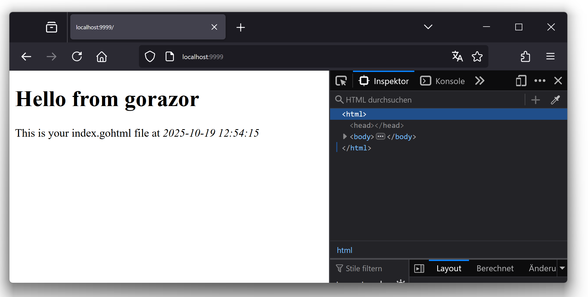
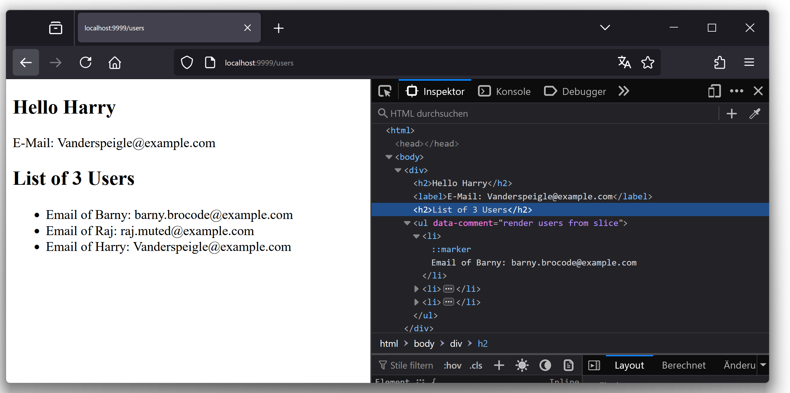

# gorazor tutorial

## Intro

`gorazor` is a translator that generates go code from  `gohtml` files that contain [razory syntax](https://haacked.com/archive/2011/01/06/razor-syntax-quick-reference.aspx/). Every `gohtml` file will be translated into a Go program with a function declared, which will return a `string` value as HTML output. 
For example the file `demo/intro.gohtml` that contains 
```html
<p>Hello world</p>
``` 

will be translated into:

```go
package demo

import (
  "bytes"
  "strings"
)

func Hello() string {
	var _b strings.Builder
	RenderHello(&_b)
	return _b.String()
}

func RenderHello(_buffer io.StringWriter) {
	_buffer.WriteString("<p>Hello world</p>")
}
```

Note: put hello.gohtml in a directory, the directory name will be used as package name in go program.
## Create a `Hello world` demo   
Create the `razor_tut` project that uses Go's built-in [HTTP server](https://gowebexamples.com/http-server/) 

```shell
mkdir razor_tut
cd razor_tut
go mod init razor_tut
export GOPATH=$PWD
```

Now create `main.go` like this:

```go
package main

import (
	"fmt"
	"net/http"
)

func main() {
	http.HandleFunc("/hello", func(w http.ResponseWriter, r *http.Request) {
		fmt.Fprintf(w, "Hello world!")
	})
	fmt.Print("Server + Handler started on http://localhost:9999/hello")
	http.ListenAndServe(":9999", nil)
}
```
Inside `razor_tut` folder type `go run main.go` to start the web server and open [localhost:9999/hello](http://localhost:9999/hello) to see `Hello world!`.

## Use `gorazor` for  `Hello world` demo  
After that create a new directory named `tpl` in your project directory `razor_tut`, create the file `index.gohtml` and write in it.

```html
<div>
    <!-- tpl/index.gohtml -->
    <main>
        <h1>Hello from gorazor</h1>
        <div>This is your index.gohtml file</div>
    </main>
</div>
```

The project should look like this 

```bash
razor_tut
├───tpl
│   └───index.gohtml
├───go.mod
└───main.go
```

Run `gorazor tpl tpl` to generate `Go` files into `tpl`. Now add import `"razor_tut/tpl"` to main.go:

```go
package main

import (
	"fmt"
	"net/http"

	"razor_tut/tpl" // import the generated code
)

func main() {
	http.HandleFunc("/hello", func(w http.ResponseWriter, r *http.Request) {
		fmt.Fprintf(w, "Hello world!")
  })

	http.HandleFunc("/", func(w http.ResponseWriter, r *http.Request) {
		fmt.Fprintf(w, tpl.Index()) // tpl.Index() was generated
	})
    fmt.Print("Server + Handler started on http://localhost:9999")
	http.ListenAndServe(":9999", nil)
}
```

Open [localhost:9999](http://localhost:9999) to see `Hello from gorazor`.


## Add Code sections to `gohtml` files

In `gohtml` you may insert `Go` code snippet, like this:
```html
@{
  import (
    "time"
  )
}
@{
   t := time.Now()
   StrTime := t.Format("2006-01-02 15:04:05")
}
<div>
    <!-- tpl/index.gohtml -->
    <main>
        <h1>Hello from gorazor</h1>
        <div>
        This is your index.gohtml file
         at <i>@StrTime </i>
        </div>
    </main>
</div>
```
The result looks like this



### Iterate over a slice 
Create file `user.go` in folder `models` like this:

```go
package models

// User stores information of a users
type User struct {
	Name  string
	Email string
	Intro string
}
```
and create file `userlist.gohtml` in folder `tpl` like this: 

```html
@{
  // file tpl/userlist.gohtml 
  import (
    "razor_tut/models"
  )
  
  var user *models.User
  var userSlice *[]models.User
}

@{
  userName := user.Name
  userEmail := user.Email
  numberOfUsers := len(*userSlice)
  users := *userSlice
}
<div>
    <h2>Hello @userName</h2>
    <label>E-Mail: @userEmail</label>
    <h2>List of @numberOfUsers Users</h2>
    <ul data-comment="render users below">
      @for _, usr := range users {
        <li>Email of @usr.Name: @usr.Email</li>  
      }
    </ul>
</div>
```
Now generate the code with `gorazor tpl tpl`. After this add this to `main.go`

```go
func main() {

    // new render userlist.gohtml at route /users
	http.HandleFunc("/users", func(w http.ResponseWriter, r *http.Request) {
		fmt.Fprintf(w, "%s", tpl.Userlist(GetUser(), GetUsers()))
	})

    // code from above goes here 
}

func GetUser() *models.User {
	return &models.User{
		Name: "Harry", Email: "Vanderspeigle@example.com", Intro: "Resident Alien",
	}
}

func GetUsers() *[]models.User {
	return &[]models.User{
		{Name: "Barny", Email: "barny.brocode@example.com", Intro: "HIMYM"},
		{Name: "Raj", Email: "raj.muted@example.com", Intro: "TBBT"},
		{Name: "Harry", Email: "Vanderspeigle@example.com", Intro: "Resident Alien"},
	}
}
```
Open [localhost:9999/users](http://localhost:9999/users) to see the userlist




For more details syntax please refer to [Web programming using the Razor syntax](http://www.asp.net/web-pages/tutorials/basics/2-introduction-to-asp-net-web-programming-using-the-razor-syntax).

## Use Javascript in `gohtml` files

And you may also add `javascript` code in `gohtml`, where ctx is `var ctx *web.Context`, details please refer to [sipin/web](http://github.com/sipin/web).


```javascript
@section js {
ctx.AddJS("/assets/js/moment.js")
ctx.AddJS("/assets/js/bootstrap-datetimepicker.js")
<script type="text/javascript">
  jQuery(document).ready(function($) {
    $(".datetimepicker").datetimepicker({
      format: "YYYY-MM-DD HH:mm:ss",
    });
  });
</script>
ctx.AddJS("/assets/js/bootstrap-multiselect.js")
<script>
  $(document).ready(function() {
    $('.multiselect').multiselect({
      enableFiltering: true,
      buttonWidth: '170px',
      maxHeight: 200
    });
  });
</script>
}
```
